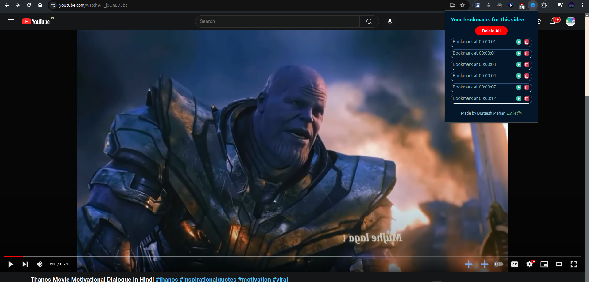

# Yt Bookmark Extension 

## Description
This extension allows users to create multiple video timeline bookmarks on YouTube. Easily manage and access your favorite moments in any YouTube video.

## Usage
1. Clone this repository.
    ```
    git clone https://github.com/durgeshmehar/Youtube-Bookmark-Extension.git
    ```
2. Go to `chrome://extensions` in your Chrome browser.
3. Enable "Developer mode" by toggling the switch in the top right corner.
4. Click on "Load unpacked" and select the downloaded repository folder.
5. Enjoy your YouTube Bookmark Extension!

## Functionality
- **Create Bookmarks**: Click on the plus (+) button on the video player to create a bookmark at the current timestamp.
- **View Bookmarks**: Click on the extension's tab to view all bookmarks for the current video.
- **Play Bookmarks**: Click on any bookmark in the list to play the video from that timestamp.
- **Delete Individual Bookmark**: Remove a specific bookmark by clicking the delete button next to it.
- **Delete All Bookmarks**: Remove all bookmarks for the current video with a single click.

## Screenshots


## Contributing
Feel free to submit issues or pull requests if you find any bugs or have feature suggestions.

## License
This project is licensed under the MIT License. See the `LICENSE` file for details.

